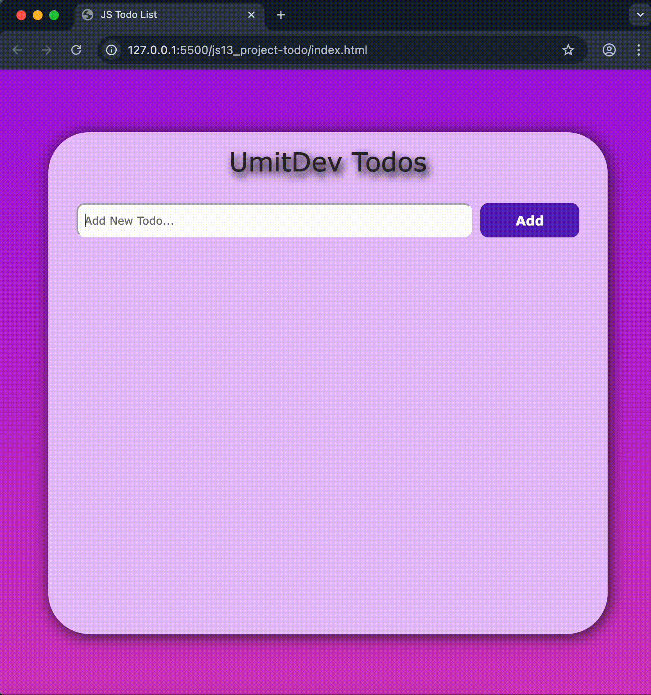

# 📝 ToDo App

Basit ve işlevsel bir **ToDo Uygulaması**.  
Kullanıcılar görev ekleyebilir, tamamlandı olarak işaretleyebilir ve silebilir.

## 🚀 Demo
👉 [Canlı Demo](https://umit8098.github.io/Project-js-ToDo-LocalStorage/)  


  
*(Proje klasörüne bir ekran görüntüsü ekleyip burada kullanabilirsin.)*

---

## ✨ Özellikler
- ✅ Yeni görev ekleme  
- ✅ Görevleri tamamlandı olarak işaretleme  
- ✅ Görevleri silme  
- ✅ Basit ve kullanıcı dostu arayüz  

---

## 🛠 Kullanılan Teknolojiler
- **HTML5**  
- **CSS3**  
- **JavaScript (Vanilla JS)**  

---

## ⚙️ Kurulum ve Çalıştırma

Projeyi kendi bilgisayarında çalıştırmak için:

```bash
# Repoyu klonla
git clone https://github.com/umit8098/todo-app.git

# Klasöre gir
cd todo-app

# index.html dosyasını tarayıcıda aç
